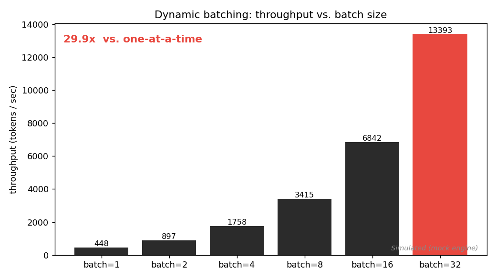
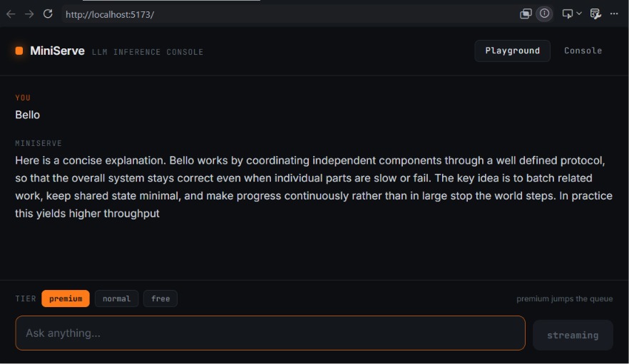
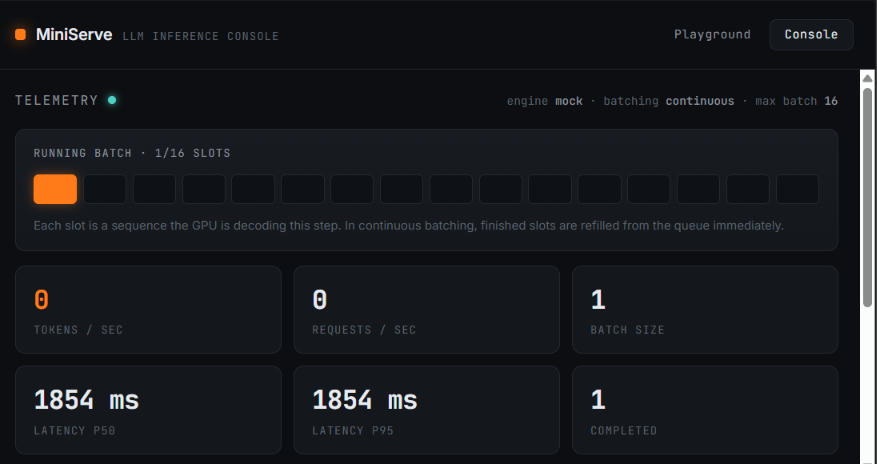
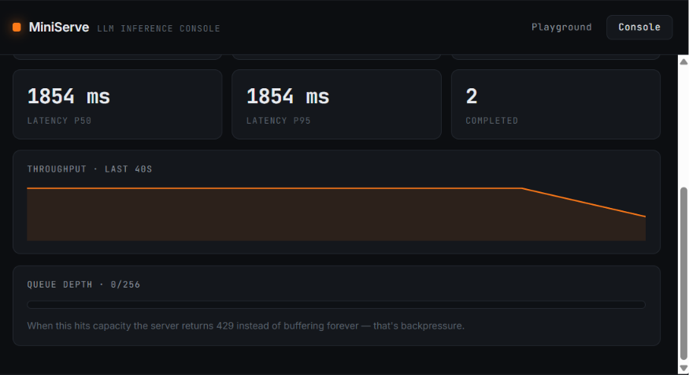

# MiniServe — a high-throughput LLM inference server

A miniature of the serving systems behind ChatGPT, Claude, and vLLM: a request
queue, a **dynamic-batching scheduler** with **continuous batching**, token
**streaming**, **backpressure**, **priority tiers**, and a live **ops console**.

The chat window is the demo. The scheduler is the project.



> The graph above is **simulated** (mock engine, no GPU). Per-step latency is
> held constant across batch sizes — the same property a real GPU has — so
> throughput scales with the batch. Point the benchmark at a real model to get
> real numbers (see below). Don't put fabricated absolute numbers on a resume;
> put the curve and explain *why* it has that shape.

## Live demo

Streaming generation — tokens arrive one at a time over Server-Sent Events,
exactly like ChatGPT. Tier selector routes premium requests ahead of free ones.



The ops console. The amber slots are the **running batch**: each lit slot is a
sequence the engine is decoding this step. In continuous batching, finished
slots are refilled from the queue immediately, so the engine never idles.



Live telemetry — throughput history, queue depth, and the backpressure
threshold (429 on overflow).



---

## What's actually here
client ──HTTP──▶ FastAPI ──▶ bounded priority queue ──▶ scheduler ──▶ engine ──▶ GPU

│                                       │            │

└──◀── SSE token stream ◀───────────────┴────────────┘

| Component | File | What it demonstrates |
|---|---|---|
| API + SSE streaming | `backend/app/main.py` | async I/O, server-sent events |
| Bounded priority queue | `backend/app/queue_manager.py` | backpressure, service tiers |
| Dynamic-batching scheduler | `backend/app/scheduler.py` | the core: continuous batching |
| Pluggable engine | `backend/app/engine.py` | mock + real transformer w/ KV cache |
| Metrics | `backend/app/metrics.py` | Prometheus + live stats |
| Ops console + chat | `frontend/` | React, streaming UI, live telemetry |
| Benchmark | `backend/benchmark.py` | the throughput-vs-batch graph |

## The one idea that matters: continuous batching

Naive serving runs one request at a time and the GPU sits idle between launches.
Static batching groups N requests but waits for the whole batch to finish before
starting the next — so a long generation stalls everyone behind it.

**Continuous (iteration-level) batching** — what `scheduler.py` implements — adds
new requests to the *running* batch every decoding step, and evicts finished ones
the moment they hit their stop condition. The engine never idles. This is the
vLLM / production-serving behaviour, and it's the difference between a toy and a
credible systems project.

```python
# scheduler.py, per step:
results = await engine.step(self.running)   # advance every sequence one token
# ... stream tokens, retire finished sequences ...
if self.continuous:
    self._admit()                           # refill empty slots from the queue NOW
```

## Run it (no GPU, no downloads)

The default engine is a simulator. The full system — queue, scheduler,
continuous batching, streaming, backpressure, metrics — runs on any laptop.

**Backend**
```bash
cd backend
pip install -r requirements.txt
uvicorn app.main:app --reload --port 8000
```

**Frontend** (separate terminal)
```bash
cd frontend
npm install
npm run dev          # http://localhost:5173
```

Open the **Console** tab and send prompts from the **Playground** — watch the
batch fill and the throughput line move.

**Or one command with Docker:**
```bash
docker compose up --build      # frontend on :8080, backend on :8000
```

## Run it with a real model

```bash
cd backend
pip install torch transformers
ENGINE=hf HF_MODEL=Qwen/Qwen2.5-0.5B-Instruct DEVICE=cuda \
  uvicorn app.main:app --port 8000
```

`HFEngine` runs a real causal LM with a real KV cache (`past_key_values`) and
streams token by token. It uses **static** batching (a batch decodes to
completion before the next forms) — correct and demonstrable, but simpler than
the mock engine's continuous path. Making `HFEngine` continuous (per-row cache
management, left-padding) is the natural "advanced" extension.

## The benchmark (centerpiece graph)

```bash
cd backend
pip install matplotlib
python benchmark.py                       # writes benchmark.png
# real numbers:
ENGINE=hf python benchmark.py
```

It runs the real scheduler in-process at batch sizes 1→32 and measures aggregate
tokens/sec. Output is a table plus `benchmark.png`.

## Endpoints

| Method | Path | Purpose |
|---|---|---|
| POST | `/chat` | SSE token stream; returns **429** under backpressure |
| GET | `/stats` | JSON snapshot for the dashboard |
| GET | `/metrics` | Prometheus scrape |
| GET | `/health` | engine + config |

Wire `/metrics` into Prometheus + Grafana for production-grade dashboards; the
built-in Console covers the demo.

## Configuration (env vars)

| Var | Default | Meaning |
|---|---|---|
| `ENGINE` | `mock` | `mock` or `hf` |
| `MAX_BATCH_SIZE` | `16` | max sequences per step |
| `BATCH_WAIT_MS` | `15` | cold-start fill window |
| `BATCHING` | `continuous` | `continuous` or `static` |
| `QUEUE_CAPACITY` | `256` | backpressure threshold |
| `HF_MODEL` | `sshleifer/tiny-gpt2` | model id for `ENGINE=hf` |
| `DEVICE` | `cpu` | `cpu` or `cuda` |

## Honest limitations 

- Mock-engine numbers are **simulated**; they show the scaling law, not GPU reality.
- `HFEngine` is **static**-batched, not continuous — that's the named next step.
- No paged-attention / no real KV-cache eviction; single process, single GPU.
- This optimizes for *clarity of the serving concepts*, not raw performance.

## Roadmap 

1. Continuous batching for `HFEngine` (per-row cache surgery, left-padding).
2. Paged KV cache (the vLLM trick) to pack more concurrent sequences.
3. Multi-GPU: shard the running batch across devices.
4. Prefill/decode disaggregation.

## License

MIT License 

Copyright (c) 2026 Sandeep

Permission is hereby granted, free of charge, to any person obtaining a copy
of this software and associated documentation files (the "Software"), to deal
in the Software without restriction, including without limitation the rights
to use, copy, modify, merge, publish, distribute, sublicense, and/or sell
copies of the Software, and to permit persons to whom the Software is
furnished to do so, subject to the following conditions:

The above copyright notice and this permission notice shall be included in all
copies or substantial portions of the Software.

THE SOFTWARE IS PROVIDED "AS IS", WITHOUT WARRANTY OF ANY KIND, EXPRESS OR
IMPLIED, INCLUDING BUT NOT LIMITED TO THE WARRANTIES OF MERCHANTABILITY,
FITNESS FOR A PARTICULAR PURPOSE AND NONINFRINGEMENT. IN NO EVENT SHALL THE
AUTHORS OR COPYRIGHT HOLDERS BE LIABLE FOR ANY CLAIM, DAMAGES OR OTHER
LIABILITY, WHETHER IN AN ACTION OF CONTRACT, TORT OR OTHERWISE, ARISING FROM,
OUT OF OR IN CONNECTION WITH THE SOFTWARE OR THE USE OR OTHER DEALINGS IN THE
SOFTWARE.
